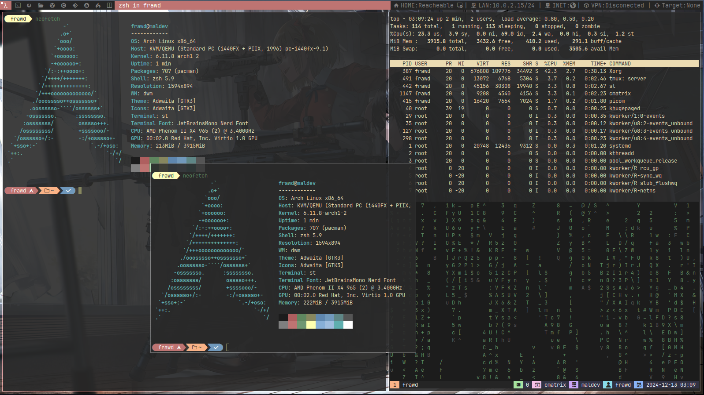

# Labfiles
------------

This is a simple, light weight and low resource environment I created in order to deploy, reverse and analyze malware samples. I also use this environment to solve CTF challenges.

The Status bar will show information that is important to me when working with malware. It will let me know if I have an active internet connection or if I'm able to reach my main Host.

Anyway, this is a preview of how it looks.

